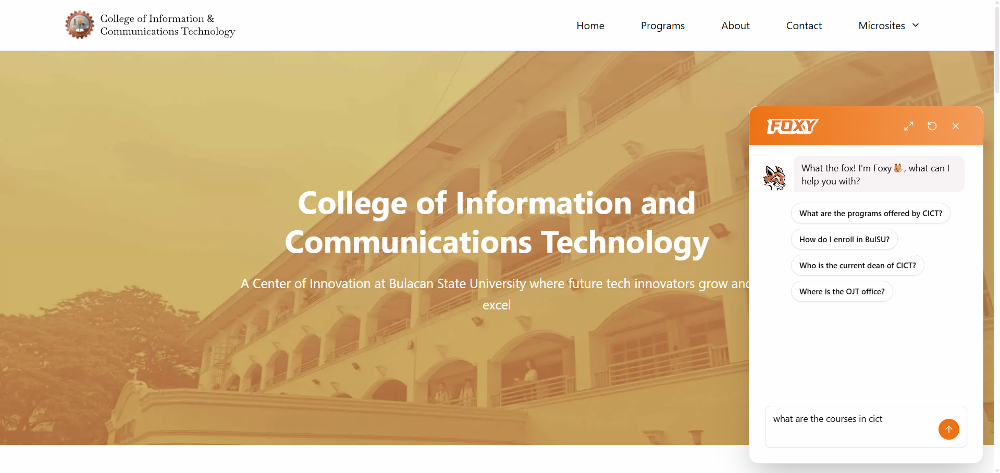
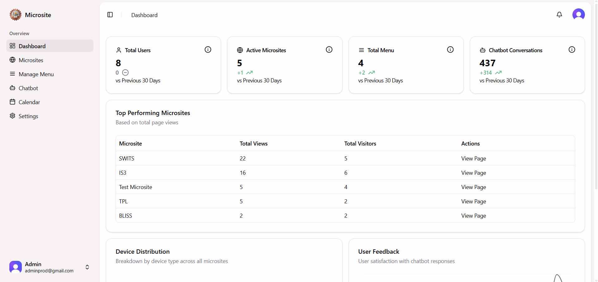
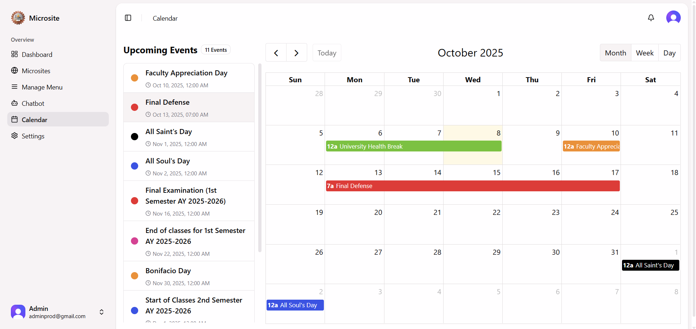
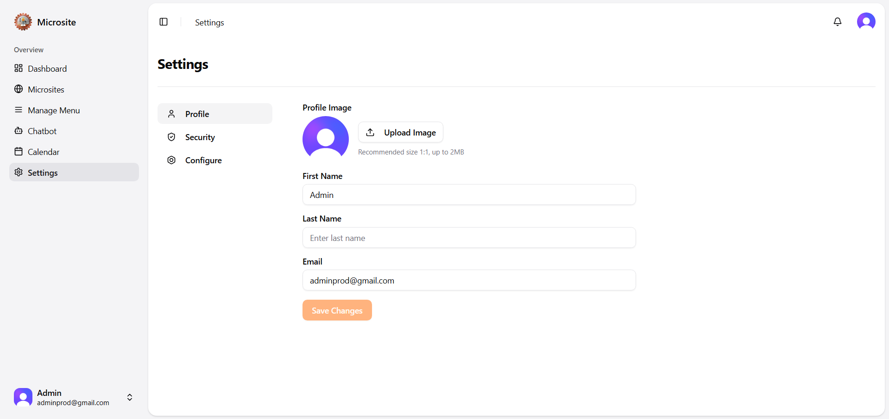
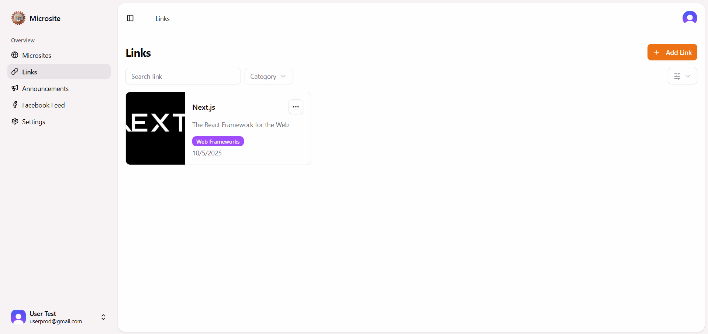
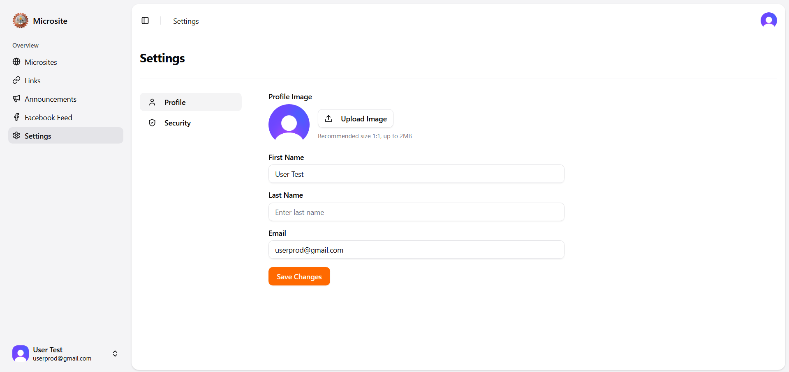

<h1 align="center">Microsite</h1>  

A multi-tenant website builder built with Next.js for the College of Information and Communications Technology (CICT) at Bulacan State University (BUlSU). It allows student organizations to create and customize their own website.

## 📝 Overview

This project was created as our capstone project. We noticed that student organizations usually rely on scattered social media posts to share updates which can be hard to keep track of.

Microsite was our solution to:

- Give each student org their own space to share information, updates, and resources.
- Make it simple to build and customize a site with no coding skills needed.
- Provide a central landing page for CICT where students can get info and ask questions via a chatbot.

## ✨ Features and Screenshots

### 🌐 Landing Page

See general information about CICT and ask questions to the chatbot.
| Landing Page | Chatbot |
| --- | --- |
|  |  |

### 🛠️ Admin Panel
Manage the entire platform through admin dashboard.  
Admin can create and manage microsites, configure menus, train the chatbot, and schedule events using the calendar.

| Dashboard | Microsites | Manage Menu |
| --- | --- | --- |
|  |  |  |

| Chatbot | Calendar | Settings |
| --- | --- | --- |
|  |  |  |

### 🛠️ User Panel
Student organization representatives can build their own microsites and manage them.

| Web Builder | Microsite | Links |
| --- | --- | --- |
|  |  |  |

| Announcements | Facebook Feed | Settings |
| --- | --- | --- |
|  |  |  |


## 🏗️ Tech Stack

This project is built with the following tools and services:

- **Frontend**: [Next.js](https://nextjs.org/), [Tailwind CSS](https://tailwindcss.com/), [shadcn/ui](https://ui.shadcn.com/)
- **Authentication**: [Clerk](https://clerk.com/)
- **Database**: [Supabase](https://supabase.com/)
- **Email Service**: [Resend](https://resend.com/)
- **AI Chatbot**: [OpenAI API](https://platform.openai.com/)
- **Web Builder**: [GrapesJS](https://grapesjs.com/)
- **Hosting**: [Vercel](https://vercel.com/)

## 🚀 Getting Started

1. Clone the repository

```bash
git clone https://github.com/alexgalicio/microsite.git
```

2. Change the working directory

```bash
cd microsite
```

3. Install dependencies

```bash
npm install
```

4. Copy env and add your keys

```bash
cp .env.example .env.local
```

5. Run the app

```bash
npm run dev
```

Open [http://localhost:3000](http://localhost:3000) with your browser to see the result.

<hr>
This project is intended for educational purposes as part of a capstone project at Bulacan State University - College of Information and Communications Technology.
